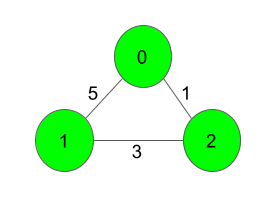
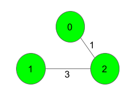
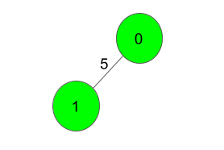

## Minimum Spanning Tree


https://www.geeksforgeeks.org/problems/minimum-spanning-tree/1


```
Given a weighted, undirected, and connected graph with V vertices and E edges, your task is to find the sum of the weights of the edges in the Minimum Spanning Tree (MST) of the graph. The graph is represented by an adjacency list, where each element adj[i] is a vector containing vector of integers. Each vector represents an edge, with the first integer denoting the endpoint of the edge and the second integer denoting the weight of the edge.
```


#### Example 1:

```
Input:
3 3
0 1 5
1 2 3
0 2 1
```

```
Output: 4
Explanation:
```

```
The Spanning Tree resulting in a weight
of 4 is shown above.

```

#### Example 2:
```
Input: 
2 1
0 1 5


Output: 5 

Explanation: Only one Spanning Tree is possible which has a weight of 5.
```


#### Expected Time Complexity: ```O(m * n)```
#### Expected Auxiliary Space: ```O(m * n)```

#### Constraints:
```
2 ≤ V ≤ 1000
V-1 ≤ E ≤ (V*(V-1))/2
1 ≤ w ≤ 1000
The graph is connected and doesn't contain self-loops & multiple edges.
```

## Solutions

#### Key Points:
```


```

* **Java**

```java
import java.util.*;

class Solution {
    static int spanningTree(int V, int E, List<List<int[]>> adj) {
        // Priority Queue (Min Heap) to pick the minimum weight edge first
        PriorityQueue<int[]> pq = new PriorityQueue<>(Comparator.comparingInt(a -> a[1]));

        // Visited array to track which nodes are included in MST
        boolean[] visited = new boolean[V];

        // Start from vertex 0
        pq.add(new int[]{0, 0});  // {node, weight}
        int mstWeight = 0;        // Stores the sum of weights of MST edges

        while (!pq.isEmpty()) {
            int[] curr = pq.poll(); // Extract min weight edge
            int node = curr[0];  
            int weight = curr[1];

            // If node is already visited, skip it
            if (visited[node]) continue;

            // Mark the node as visited
            visited[node] = true;

            // Add weight to MST sum
            mstWeight += weight;

            // Explore all adjacent edges
            for (int[] neighbor : adj.get(node)) {
                int adjNode = neighbor[0];  // Neighboring node
                int edgeWeight = neighbor[1]; // Weight of edge

                // Add unvisited nodes to priority queue
                if (!visited[adjNode]) {
                    pq.add(new int[]{adjNode, edgeWeight});
                }
            }
        }

        return mstWeight; // Return total weight of MST
    }
}

```

## **Approach & Intuition**
The problem requires us to find the **Minimum Spanning Tree (MST)** of a **connected, weighted, and undirected graph** using its **adjacency list representation**. The MST is a subset of edges that:
- **Connects all vertices** in the graph.
- **Has no cycles** (forms a tree).
- **Has the minimum possible sum of edge weights**.

To efficiently compute the MST, we use **Prim’s Algorithm** because:
- It works well with adjacency lists.
- It uses a **Priority Queue (Min Heap)** to always expand the least-weighted edge first.
- It has a **time complexity of O(E log V)** using a Min Heap.

---

## **Algorithm**
We implement **Prim’s Algorithm** as follows:

1. **Initialize a Min Heap**: Store edges with their weights.
2. **Use a Visited Array**: To track visited nodes.
3. **Start from any node** (typically node **0**).
4. **Pick the minimum weight edge** that expands the MST.
5. **Add its weight to the MST Sum** and mark the node as visited.
6. **Push all unvisited neighbors** of the current node into the Min Heap.
7. **Repeat** until all vertices are included in the MST.

---


## **Example & Dry Run**
### **Input**
```
V = 3, E = 3
Edges:
0 - 1 (5)
1 - 2 (3)
0 - 2 (1)
```
### **Adjacency List Representation**
```
adj[0] = { {1, 5}, {2, 1} }
adj[1] = { {0, 5}, {2, 3} }
adj[2] = { {0, 1}, {1, 3} }
```
---

### **Dry Run**
#### **Initialization**
- **Min Heap:** `{(0,0)}` (start from node `0` with weight `0`).
- **MST Sum:** `0`
- **Visited:** `[F, F, F]`

#### **Step 1: Pick (0,0)**
- Mark `0` as visited: `[T, F, F]`
- Add edges: `{(1,5), (2,1)}`
- **Min Heap:** `{(2,1), (1,5)}`

#### **Step 2: Pick (2,1)**
- Mark `2` as visited: `[T, F, T]`
- Add edges: `{(1,3)}` (since `0` is already visited)
- **Min Heap:** `{(1,3), (1,5)}`
- **MST Sum:** `1`

#### **Step 3: Pick (1,3)**
- Mark `1` as visited: `[T, T, T]`
- No new edges (all visited)
- **MST Sum:** `1 + 3 = 4`

### **Final MST**
```
0 --- 2 (1)
|
2 --- 1 (3)
```
### **Output**
```
4
```

---

## **Time Complexity Analysis**
- **Min Heap Operations:** `O(E log V)`
- **Each Edge Inserted Once:** `O(E log V)`
- **Overall Complexity:** `O(E log V)`

---

## **Key Takeaways**
✅ **Prim’s Algorithm** efficiently finds MST using a **Min Heap**.  
✅ **Priority Queue** ensures we always pick the **minimum weighted edge**.  
✅ **Visited Array** prevents revisiting nodes.  
✅ **Time Complexity: O(E log V), suitable for large graphs.**  
✅ **Used Adjacency List Representation for efficiency.**  


