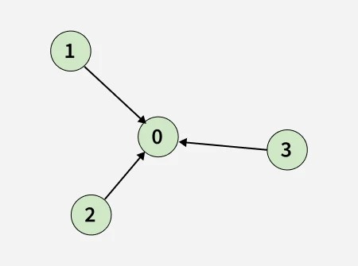
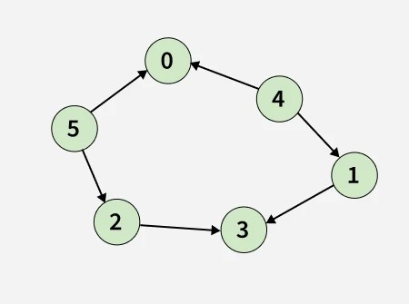

## Topological sort


https://www.geeksforgeeks.org/problems/topological-sort/1


### 📘 Problem Statement: Topological Sort of a DAG

Given a **Directed Acyclic Graph (DAG)** of `V` (from `0` to `V-1`) vertices and `E` edges, represented as a 2D list `edges[][]`, where each entry `edges[i] = [u, v]` denotes a **directed edge** from `u` to `v`.

Your task is to **return the topological sort** for the given graph.

---

### ✅ Topological Sorting

Topological sorting for a **Directed Acyclic Graph (DAG)** is a **linear ordering of vertices** such that for every directed edge `u -> v`, vertex `u` comes **before** `v` in the ordering.

---

### 📝 Notes:

- There may be **multiple valid Topological Orderings**.
- You may return **any one** of them.
- If your returned topological sort is correct, then the **output will be `true`**, otherwise `false`.

---


#### Example 1:


```
Input: V = 4, E = 3, edges[][] = [[3, 0], [1, 0], [2, 0]]
```

```
Output: true
Explanation: The output true denotes that the order is valid. Few valid Topological orders for the given graph are:
[3, 2, 1, 0]
[1, 2, 3, 0]
[2, 3, 1, 0]

```

#### Example 2:
```
Input: V = 6, E = 6, edges[][] = [[1, 3], [2, 3], [4, 1], [4, 0], [5, 0], [5,2]]
```

```
Output: true
Explanation: The output true denotes that the order is valid. Few valid Topological orders for the graph are:
[4, 5, 0, 1, 2, 3]
[5, 2, 4, 0, 1, 3]
```

#### Constraints:
```
2  ≤  V  ≤  10^3
1  ≤  E = edges.size()  ≤  (V * (V - 1)) / 2
```

## Solutions

#### Key Points:
```


```

Sure! Let's solve the **Topological Sort** problem using **Kahn’s Algorithm** (BFS approach) with `edges[][]` input.

---

## ✅ **Intuition**

Given `edges[][]` where each entry is `[u, v]`, it means there's a **directed edge from `u` to `v`** (`u → v`).  
Topological sorting ensures that for **every directed edge `u → v`**, node `u` comes **before** node `v` in the result.

Kahn’s Algorithm works by:
- Counting **in-degrees** (number of incoming edges) for each node.
- Nodes with **in-degree = 0** can safely be placed in topological order.
- Once a node is placed, decrease the in-degrees of its neighbors.
- Repeat until all nodes are processed.

---

## ✅ **Approach / Algorithm**

```
1. Initialize an adjacency list from edges[][].
2. Compute in-degree of each vertex.
3. Initialize a queue and add all vertices with in-degree 0.
4. While queue is not empty:
    a. Pop a vertex and add to result.
    b. Decrease in-degree of its neighbors.
    c. If in-degree of neighbor becomes 0, add to queue.
5. Return result.
```

---

## ✅ **Java Code with Comments**

```java
import java.util.*;

class Solution {
    public static ArrayList<Integer> topoSort(int V, int[][] edges) {
        // Step 1: Create the adjacency list for the graph
        List<List<Integer>> adj = new ArrayList<>();

        // Create an empty list for each vertex
        for (int i = 0; i < V; i++) {
            adj.add(new ArrayList<>());
        }

        // Fill the adjacency list from the edges array
        // edges[i] = [u, v] means there is a directed edge from u to v
        for (int[] edge : edges) {
            int u = edge[0]; // from node u
            int v = edge[1]; // to node v
            adj.get(u).add(v); // Add v to u’s adjacency list
        }

        // Step 2: Compute the in-degree for each node
        // in-degree means how many incoming edges each node has
        int[] inDegree = new int[V]; // initially all 0
        for (int u = 0; u < V; u++) {
            for (int v : adj.get(u)) {
                inDegree[v]++; // increase in-degree for every destination node
            }
        }

        // Step 3: Add all nodes with in-degree 0 to the queue
        // These are the starting points in topological sort
        Queue<Integer> q = new LinkedList<>();
        for (int i = 0; i < V; i++) {
            if (inDegree[i] == 0) {
                q.offer(i); // No incoming edges, safe to start from here
            }
        }

        // Step 4: Perform BFS (Kahn’s algorithm) for topological sort
        ArrayList<Integer> topoOrder = new ArrayList<>(); // to store result

        while (!q.isEmpty()) {
            int node = q.poll(); // Get a node with in-degree 0
            topoOrder.add(node); // Add to topological order

            // Go through all neighbors of this node
            for (int neighbor : adj.get(node)) {
                inDegree[neighbor]--; // Remove the edge (i.e., reduce in-degree)

                // If in-degree becomes 0, add it to the queue
                if (inDegree[neighbor] == 0) {
                    q.offer(neighbor);
                }
            }
        }

        // Step 5: Return the topological ordering
        return topoOrder;
    }
}

```


---

### ✅ **Step-by-Step Algorithm Summary in Comments**

```
// 1. Create adjacency list from given edges.
// 2. Initialize in-degree array to count incoming edges for each node.
// 3. Populate the in-degree array using the adjacency list.
// 4. Add all nodes with in-degree = 0 to a queue (they have no dependencies).
// 5. While the queue is not empty:
//    a. Remove a node from the queue and add to result.
//    b. For all its neighbors:
//       - Decrease their in-degree by 1.
//       - If a neighbor's in-degree becomes 0, add it to the queue.
// 6. Return the result list as the topological sort.
```

---

### ✅ **Example Dry Run**

**Input:**

```java
V = 4
edges = [[3, 0], [1, 0], [2, 0]]
```

**Adjacency List:**

```
3 -> [0]
1 -> [0]
2 -> [0]
0 -> []
```

**In-degree Array:**

```
inDegree[0] = 3 (3 incoming edges)
inDegree[1] = 0
inDegree[2] = 0
inDegree[3] = 0
```

**Queue Initialization:**

```
q = [1, 2, 3]
```

**Processing:**

1. Pop 1 → topoOrder = [1] → inDegree[0] = 2
2. Pop 2 → topoOrder = [1, 2] → inDegree[0] = 1
3. Pop 3 → topoOrder = [1, 2, 3] → inDegree[0] = 0 → Add 0 to queue
4. Pop 0 → topoOrder = [1, 2, 3, 0]

✅ Valid topological sort.

---


---

## ✅ **Dry Run**

### Input:
```java
V = 4, edges = [[3, 0], [1, 0], [2, 0]]
```

### Step 1: Build adjacency list
```
adj:
0 -> []
1 -> [0]
2 -> [0]
3 -> [0]
```

### Step 2: Compute in-degrees
```
inDegree[0] = 3  // 3, 2, 1 point to 0
inDegree[1] = 0
inDegree[2] = 0
inDegree[3] = 0
```

### Step 3: Queue = [1, 2, 3]

### Process:
- Pop 1 → result: [1], 0’s inDegree = 2
- Pop 2 → result: [1, 2], 0’s inDegree = 1
- Pop 3 → result: [1, 2, 3], 0’s inDegree = 0 → add 0
- Pop 0 → result: [1, 2, 3, 0]

✅ Final Output: `[1, 2, 3, 0]` (valid topological sort)

---

## ✅ **Line-by-Line Explanation**

```java
// Create adjacency list from edges
List<List<Integer>> adj = new ArrayList<>();
for (int i = 0; i < V; i++) {
    adj.add(new ArrayList<>()); // Empty list for each node
}
for (int[] edge : edges) {
    int u = edge[0];
    int v = edge[1];
    adj.get(u).add(v); // Directed edge u → v
}

// Create and fill in-degree array
int[] inDegree = new int[V];
for (int u = 0; u < V; u++) {
    for (int v : adj.get(u)) {
        inDegree[v]++;
    }
}

// Queue with in-degree 0 nodes
Queue<Integer> q = new LinkedList<>();
for (int i = 0; i < V; i++) {
    if (inDegree[i] == 0) q.offer(i);
}

// BFS-like processing
ArrayList<Integer> topoOrder = new ArrayList<>();
while (!q.isEmpty()) {
    int node = q.poll();
    topoOrder.add(node);

    for (int neighbor : adj.get(node)) {
        inDegree[neighbor]--;
        if (inDegree[neighbor] == 0) q.offer(neighbor);
    }
}
```

---

## ✅ **Time and Space Complexity**

- **Time Complexity:** `O(V + E)`
  - Building the adjacency list: `O(E)`
  - Traversing nodes and edges: `O(V + E)`

- **Space Complexity:** `O(V + E)`
  - For adjacency list, in-degree array, and queue.

---


