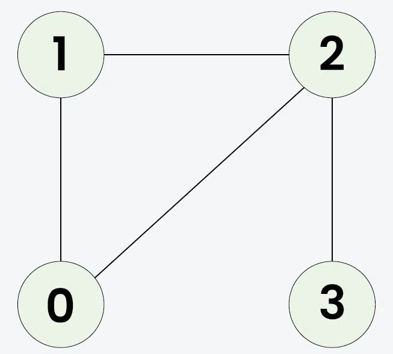
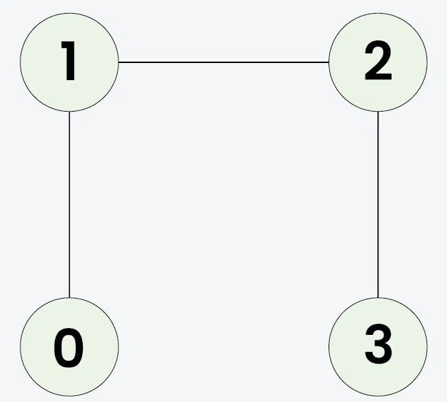

## Undirected Graph Cycle


https://www.geeksforgeeks.org/problems/detect-cycle-in-an-undirected-graph/1


Given an undirected graph with `V` vertices and `E` edges, represented as a 2D vector `edges[][]`, where each entry `edges[i] = [u, v]` denotes an edge between vertices u and v, determine whether the graph contains a `cycle` or not.


#### Example 1:

```
Input: V = 4, E = 4, edges[][] = [[0, 1], [0, 2], [1, 2], [2, 3]]
Output: true
Explanation:

```

`1 -> 2 -> 0 -> 1 is a cycle.`
#### Example 2:
```
Input: V = 4, E = 3, edges[][] = [[0, 1], [1, 2], [2, 3]]
Output: false
Explanation: 
```

No cycle in the graph.


```
1 ≤ V ≤ 105
1 ≤ E = edges.size() ≤ 105
```


#### Constraints:
```

```

## Solutions

#### Key Points:
```


```

Here’s the completed `isCycle` function using the **BFS-based approach** (as discussed), where the graph is given in the form of an edge list (`int[][] edges`). We will first convert the edge list into an **adjacency list** and then apply **BFS traversal** to detect cycles in the undirected graph.

---

### ✅ Final Code with Step-by-Step Comments

```java
import java.util.*;

class Solution {
    // Function to check if the undirected graph contains a cycle
    public boolean isCycle(int V, int[][] edges) {
        // Step 1: Convert edge list to adjacency list
        List<Integer>[] adj = new ArrayList[V];
        for (int i = 0; i < V; i++) {
            adj[i] = new ArrayList<>();
        }

        // Step 2: Fill the adjacency list from edge list
        for (int[] edge : edges) {
            int u = edge[0];
            int v = edge[1];
            adj[u].add(v);
            adj[v].add(u); // Since graph is undirected
        }

        // Step 3: Create a visited array to mark visited nodes
        boolean[] visited = new boolean[V];

        // Step 4: Check all disconnected components
        for (int i = 0; i < V; i++) {
            if (!visited[i]) {
                // Step 5: If cycle is found in any component, return true
                if (bfs(i, adj, visited)) {
                    return true;
                }
            }
        }

        // Step 6: No cycle found in any component
        return false;
    }

    // Helper function to perform BFS and detect cycle
    private boolean bfs(int startNode, List<Integer>[] adj, boolean[] visited) {
        // Step 1: Use a queue to perform BFS, storing pairs {node, parent}
        Queue<int[]> q = new LinkedList<>();
        q.add(new int[]{startNode, -1});
        visited[startNode] = true;

        // Step 2: Start BFS traversal
        while (!q.isEmpty()) {
            int[] current = q.poll();
            int node = current[0];
            int parent = current[1];

            // Step 3: Visit all neighbors of the current node
            for (int neighbor : adj[node]) {
                if (!visited[neighbor]) {
                    // If neighbor is not visited, mark it and add to queue
                    visited[neighbor] = true;
                    q.add(new int[]{neighbor, node});
                } else if (neighbor != parent) {
                    // If neighbor is visited and not parent, cycle found
                    return true;
                }
            }
        }

        // Step 4: No cycle found in this component
        return false;
    }
}
```

---

### ✅ Sample Execution

**Input:**
```java
V = 4;
edges = [[0,1], [0,2], [1,2], [2,3]];
```

**Output:**
```java
true
```

---

### ✅ Complexity Analysis

- **Time Complexity:** `O(V + E)`  
  (Every node and edge is visited once)
  
- **Space Complexity:** `O(V + E)`  
  (Adjacency list + visited array + BFS queue)

---


