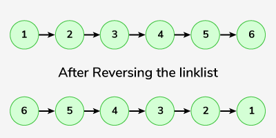
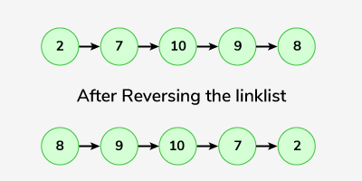

## Reverse a linked list


https://www.geeksforgeeks.org/problems/reverse-a-linked-list/1


```
Given the head of a linked list, the task is to reverse this list and return the reversed head.
```


#### Example 1:

```
Input: Linked list: 1->2->3->4->5->6
Output: 6->5->4->3->2->1
Explanation:
```

#### Example 2:
```
Input: Linked list: 2->7->10->9->8 
Output: 8->9->10->7->2
Explanation:
```

#### Example 3:
```
Input: Linked List: 10
Output: 10
Explanation: For a single node list, the reverse would be same as original
```
### Your Task:

```
Expected Time Complexity: O(n)
Expected Space Complexity: O(1)
```

#### Constraints:
```
1 <= number of nodes, data of nodes <= 105
```

## Solutions

#### Key Points:
```


```

* **Java**

```
class Solution {
    // Function to reverse a linked list.
    Node reverseList(Node head) {
        // Initialize current node to head
        Node curr = head;
        // Initialize previous node to null
        Node prev = null;
        
        // Iterate through the list until current node is null
        while (curr != null) {
            // Save the next node
            Node next = curr.next;
            // Reverse the current node's pointer
            curr.next = prev;
            // Move the previous node to the current node
            prev = curr;
            // Move the current node to the next node
            curr = next;
        }
        
        // Return the new head of the reversed list (previous node)
        return prev;
    }
}

```


