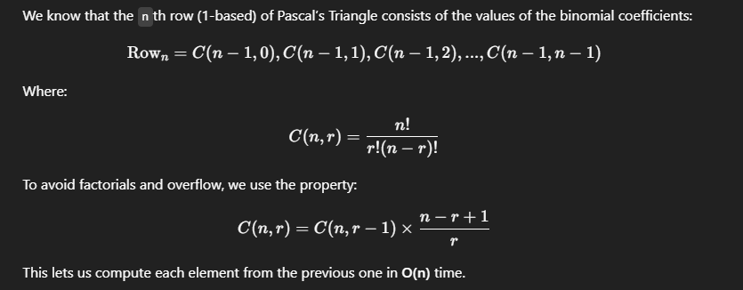
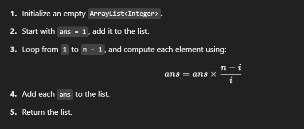

## Pascal Triangle


https://www.geeksforgeeks.org/problems/pascal-triangle0652/1

<div class="problems_problem_content__Xm_eO"><p><span style="font-size: 14pt;">Given a positive integer <strong>n</strong>, return the <strong>n<sup>th</sup> row&nbsp;of <a href="https://en.wikipedia.org/wiki/Pascal%27s_triangle" target="_blank" rel="noopener"><em><span style="text-decoration: underline;">pascal's triangle</span></em></a></strong>.<br>Pascal's triangle is a triangular array of the binomial coefficients formed by summing up the elements of previous row.<br></span></p>
<p><span style="font-size: 14pt;"></span></p>
<p><span style="font-size: 14pt;"><strong>Examples:</strong></span></p>
<pre><span style="font-size: 14pt;"><strong>Input: </strong>n = 4
<strong>Output:</strong> [1, 3, 3, 1]
<strong>Explanation:</strong> 4<sup>th</sup> row of pascal's triangle is {1, 3, 3, 1}.</span></pre>
<pre><span style="font-size: 14pt;"><strong>Input: </strong>n = 5
<strong>Output:</strong> [1, 4, 6, 4, 1]
<strong>Explanation:</strong> 5<sup>th</sup> row of pascal's triangle is {1, 4, 6, 4, 1}.<br></span></pre>
<pre><span style="font-size: 14pt;"><strong>Input: </strong>n = 1
<strong>Output:</strong> [1]
<strong>Explanation:</strong> 1<sup>st</sup> row of pascal's triangle is {1}.</span></pre>
<p><span style="font-size: 14pt;"><strong>Constraints:</strong><br>1 ≤ n ≤ 20</span></p></div>

## Solutions

#### Key Points:
```


```


---

## ✅ Problem Restatement  
Given a positive integer `n` (1-based index), return the `n`th row of Pascal’s Triangle.  
Each number in the triangle is a **binomial coefficient** and can be calculated without constructing the full triangle.

---

## ✅ Intuition  



---

## ✅ Algorithm
1. Initialize an empty `ArrayList<Integer>`.
2. Start with `ans = 1`, add it to the list.
3. Loop from `1` to `n - 1`, and compute each element using:
   \[
   ans = ans \times \frac{n - i}{i}
   \]
4. Add each `ans` to the list.
5. Return the list.



---

## ✅ Java Code with Step-by-Step Explanation

```java
class Solution {

    ArrayList<Integer> nthRowOfPascalTriangle(int n) {
        // Step 1: Initialize an ArrayList to store the result
        ArrayList<Integer> row = new ArrayList<>();

        // Step 2: The first element is always 1
        long ans = 1;
        row.add((int)ans);  // C(n-1, 0) = 1

        // Step 3: Loop to calculate remaining elements
        for (int i = 1; i < n; i++) {
            // Using the formula: C(n, r) = C(n, r-1) * (n - r + 1) / r
            // Here n is n-1 (0-indexed), so use (n - i) and i
            ans = ans * (n - i);
            ans = ans / i;

            // Step 4: Add computed value to row
            row.add((int)ans);  // Typecast to int as values are guaranteed small
        }

        // Step 5: Return the computed row
        return row;
    }
}
```

---

## ✅ Dry Run Example

### Input: `n = 5`
We want the 5th row (1-based), i.e. Row index `n - 1 = 4`

- Start with `ans = 1` → row = `[1]`
- i = 1:  
  `ans = 1 * (5 - 1) / 1 = 4` → row = `[1, 4]`
- i = 2:  
  `ans = 4 * (5 - 2) / 2 = 6` → row = `[1, 4, 6]`
- i = 3:  
  `ans = 6 * (5 - 3) / 3 = 4` → row = `[1, 4, 6, 4]`
- i = 4:  
  `ans = 4 * (5 - 4) / 4 = 1` → row = `[1, 4, 6, 4, 1]`

✅ Output: `[1, 4, 6, 4, 1]`

---

## ✅ Time & Space Complexity
- **Time:** O(n)
- **Space:** O(n)

---


