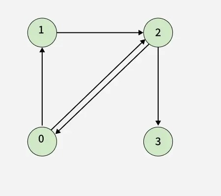
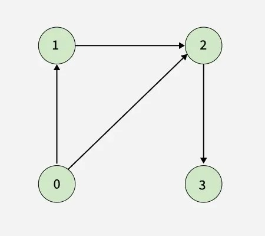

## Directed Graph Cycle


https://www.geeksforgeeks.org/problems/detect-cycle-in-a-directed-graph/1


Given a Directed Graph with `V` vertices (Numbered from `0` to `V-1`) and `E` edges, check whether it contains any `cycle` or not.
The graph is represented as a 2D vector `edges[][]`, where each entry `edges[i] = [u, v]` denotes an edge from verticex `u` to `v`.


#### Example 1:

```
Input: V = 4, edges[][] = [[0, 1], [0, 2], [1, 2], [2, 0], [2, 3]]
```

```
Output: true
Explanation: The diagram clearly shows a cycle 0 → 2 → 0
```
#### Example 2:
```
Input: V = 4, edges[][] = [[0, 1], [0, 2], [1, 2], [2, 3]]
```

```
Output: false
Explanation: no cycle in the graph
```


#### Constraints:
```
1 ≤ V, E ≤ 10^5
```


### Expected Complexities
- Time Complexity: `O(V + E)`
- Auxiliary Space: `O(V + E)`


## Solutions

#### Key Points:
```


```


---

### ✅ **Approach (DFS-based Cycle Detection)**

1. Use a **visited array** to mark all visited nodes.
2. Use a **recursion stack (pathVisited)** to detect **back edges** (which form a cycle).
3. If during DFS traversal, we visit a node that is **already in the recursion stack**, then a cycle is found.

---

### 💻 Complete Code (with comments):

```java
import java.util.*;

class Solution {

    // DFS helper function to detect cycle
    private boolean dfs(int node, List<List<Integer>> adj, boolean[] visited, boolean[] pathVisited) {
        // Mark current node as visited
        visited[node] = true;

        // Mark node as visited in the current path
        pathVisited[node] = true;

        // Traverse all neighbors
        for (int neighbor : adj.get(node)) {

            // If the neighbor is already in current path → cycle found
            if (pathVisited[neighbor]) return true;

            // If neighbor is not visited, recurse
            else if (!visited[neighbor]) {
                if (dfs(neighbor, adj, visited, pathVisited)) return true;
            }
        }

        // Backtrack: remove node from current path
        pathVisited[node] = false;

        return false;
    }

    public boolean isCyclic(int V, int[][] edges) {
        // Step 1: Build adjacency list from edge list
        List<List<Integer>> adj = new ArrayList<>();
        for (int i = 0; i < V; i++) adj.add(new ArrayList<>());

        for (int[] edge : edges) {
            int u = edge[0], v = edge[1];
            adj.get(u).add(v);
        }

        // Step 2: Create visited and pathVisited arrays
        boolean[] visited = new boolean[V];
        boolean[] pathVisited = new boolean[V];

        // Step 3: DFS for every unvisited node
        for (int i = 0; i < V; i++) {
            if (!visited[i]) {
                if (dfs(i, adj, visited, pathVisited)) return true;
            }
        }

        // No cycle found in any component
        return false;
    }
}
```

---

### 🔍 Example Dry Run:

#### Input:
```java
V = 4
edges = [[0, 1], [0, 2], [1, 2], [2, 0], [2, 3]]
```

#### Process:
- Start DFS from 0 → 1 → 2 → 0 again (already in path) → **Cycle Detected**

#### Output: `true`

---

### ⏱️ Time and Space Complexity

- **Time Complexity**: `O(V + E)`
- **Space Complexity**: `O(V)` for visited and recursion stack


