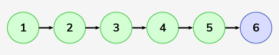

## Linked List Insertion At End


https://www.geeksforgeeks.org/problems/linked-list-insertion-1587115620/1


```
Given the head of a Singly Linked List and a value x, insert that value x at the end of the LinkedList and return the modified Linked List.
```


#### Example 1:

```
Input: LinkedList: 1->2->3->4->5 , x = 6
Output: 1->2->3->4->5->6
Explanation: 
We can see that 6 is inserted at the end of the linkedlist.
```

#### Example 2:

```
Input: LinkedList: 5->4 , x = 1
Output: 5->4->1
Explanation: 
We can see that 1 is inserted at the end of the linkedlist.
```
### Your Task:

```
Expected Time Complexity: O(n)
Expected Auxiliary Space: O(1)
```

#### Constraints:
```
0 <= number of nodes <= 105
1 <= node->data , x <= 103
```

## Solutions

#### Key Points:
```


```

* **Java**

```
class Solution {
    // Function to insert a node at the end of the linked list.
    Node insertAtEnd(Node head, int x) {
        // code here
        Node temp = new Node(x);
        if(head == null) {
            return temp;
        }
        
        Node curr = head;
        while(curr.next != null) {
            curr = curr.next;
        }
        
        curr.next = temp;
        return head;
    }
}
```


