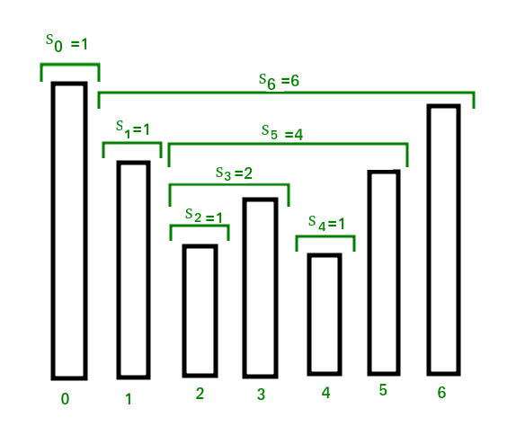

## Stock span problem


https://www.geeksforgeeks.org/problems/stock-span-problem-1587115621/1


```
The stock span problem is a financial problem where we have a series of n daily price quotes for a stock and we need to calculate the span of stocks price for all n days. 
The span Si of the stocks price on a given day i is defined as the maximum number of consecutive days just before the given day, for which the price of the stock on the given day is less than or equal to its price on the current day.
For example, if an array of 7 days prices is given as {100, 80, 60, 70, 60, 75, 85}, then the span values for corresponding 7 days are {1, 1, 1, 2, 1, 4, 6}.
```


#### Example 1:

```
Input: 
N = 7, price[] = [100 80 60 70 60 75 85]
Output:
1 1 1 2 1 4 6
Explanation:
Traversing the given input span 
100 is greater than equal to 100 and there are no more elements behind it so the span is 1,
80 is greater than equal to 80 and smaller than 100 so the span is 1,
60 is greater than equal to 60 and smaller than 80 so the span is 1,
70 is greater than equal to 60,70 and smaller than 80 so the span is 2,
60 is greater than equal to 60 and smaller than 70 so the span is 1,
75 is greater than equal to 60,70,60,75 and smaller than 100 so the span is 4,
85 is greater than equal to 80,60,70,60,75,85 and smaller than 100 so the span is 6. 
Hence the output will be 1 1 1 2 1 4 6.

```

#### Example 2:
```
Input: 
N = 6, price[] = [10 4 5 90 120 80]
Output:
1 1 2 4 5 1
Explanation:
Traversing the given input span 
10 is greater than equal to 10 and there are no more elements behind it so the span is 1,
4 is greater than equal to 4 and smaller than 10 so the span is 1,
5 is greater than equal to 4,5 and smaller than 10 so the span is 2,
90 is greater than equal to all previous elements so the span is 4,
120 is greater than equal to all previous elements so the span is 5,
80 is greater than equal to 80 and smaller than 120 so the span is 1,
Hence the output will be 1 1 2 4 5 1.
```
### Your Task:

```
The task is to complete the function calculateSpan() which takes two parameters, an array price[] denoting the price of stocks, and an integer N denoting the size of the array and number of days. This function finds the span of stock's price for all N days and returns an array of length N denoting the span for the i-th day.

Expected Time Complexity: O(N).
Expected Auxiliary Space: O(N).


```


#### Constraints:
```
1 ≤ N ≤ 105
1 ≤ C[i] ≤ 105
```

## Solutions

#### Key Points:
```


```

* **Java**

```
import java.util.Stack;

class Solution {
    // Function to calculate the span of stock’s price for all n days.
    public static int[] calculateSpan(int price[], int n) {
        int[] span = new int[n]; // Array to store span values
        Stack<Integer> s = new Stack<>(); // Stack to store indices of stock prices
        
        // Push the index of the first day
        s.push(0);
        span[0] = 1; // Span of the first day is always 1
        
        // Iterate over the stock prices starting from the second day
        for (int i = 1; i < n; i++) {
            // Pop elements from the stack while the stack is not empty and the current price is greater than the price at the index stored at the top of the stack
            while (!s.isEmpty() && price[s.peek()] <= price[i]) {
                s.pop();
            }
            // Calculate the span
            span[i] = s.isEmpty() ? i + 1 : i - s.peek();
            // Push the current day's index onto the stack
            s.push(i);
        }
        
        return span; // Return the array containing spans
    }

    // Main method to test the calculateSpan function
    public static void main(String[] args) {
        int[] price = {18, 12, 13, 14, 11, 16};
        int n = price.length;
        
        int[] spans = calculateSpan(price, n);
        
        // Print the spans for the given stock prices
        for (int span : spans) {
            System.out.print(span + " ");
        }
    }
}

```